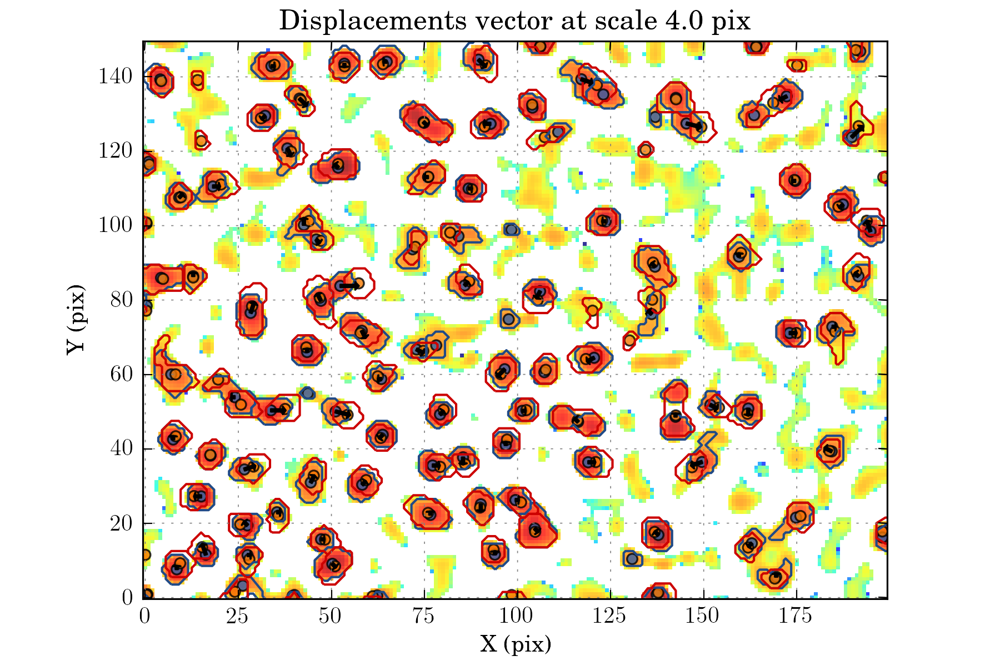

Walkthrough particle diffusing in water
=======================================

In this walkthrough we will explore the potential of WISE for the
analysis of micron-sized particles diffusing in water. We will use
images from
https://soft-matter.github.io/trackpy/tutorial/walkthrough.html, detect
and track the particles, and compare our result to the one obtained by
the trackpy team.

Setup
-----

.. code:: python

    import os
    import datetime
    import numpy as np
    
    import astropy.units as u
    
    import wise
    from wise import wiseutils, wisetasks
    from libwise import imgutils, plotutils, nputils, profileutils, presetutils
    
    %matplotlib gtk
.. code:: python

    ctx = wiseutils.AnalysisContext()

Setting up the data configuration:
---------------------------------

The full data set is composed of 300 images. We will first analyse only
part of it. We use a k sigma estimator to estimate the noise level in
the images:

.. code:: python

    BASE_DIR = os.path.expanduser("~/data/bulk_water")
    
    def get_bg(self, img):
        return nputils.k_sigma_noise_estimation(img.data)
    
    def pre_process(self, img):    
        img.resize((150, 200))
        img.data = 255 - img.data
    
    ctx.config.data.data_dir = os.path.join(BASE_DIR, "run001")
    ctx.config.data.bg_fct = get_bg
    ctx.config.data.pre_process_fct = pre_process
    ctx.config.data.projection_relative = False
    
    ctx.select_files(os.path.join(BASE_DIR, 'data/*0[0-9][0-9].png'), step=5)

.. parsed-literal::

    Number of files selected: 20

.. code:: python

    wisetasks.view_all(ctx, cmap=plotutils.get_cmap('winter_r'))

Setting up the detection configuration:
--------------------------------------

We want to track only the most prominent particles, and to control it
we set an high value for alpha\_detection. Also the particles are
typically all of the same sizes, and the displacement from image to
image is small, so we can perform the analysis only on one scale of the
wavelet decomposition:

.. code:: python

    ctx.config.finder.min_scale = 2
    ctx.config.finder.max_scale = 3
    ctx.config.finder.exclude_noise = False
    ctx.config.finder.alpha_detection = 15
    ctx.config.finder.alpha_threashold = 10
    ctx.config.finder.ms_dec_klass = wise.WaveletMultiscaleDecomposition
.. code:: python

    wisetasks.detection_all(ctx)

.. code:: python

    wisetasks.view_wds(ctx, num=False)

Setting up the matching configuration:
-------------------------------------

A reasonable maximum displacement from image to image is 5 pixels. For
this tests, we do not needs the extra features of ScaleMatcherMSCSC2,
and we can use the more simple and faster ScaleMatcherMSCI matcher:

.. code:: python

    ctx.config.matcher.maximum_delta = 5
    ctx.config.matcher.mscsc2_smooth = False
    ctx.config.matcher.ignore_features_at_border = True
    ctx.config.matcher.method_klass = wise.ScaleMatcherMSCI

.. code:: python

    wisetasks.match_all(ctx)

.. code:: python

    wisetasks.view_displacements(ctx, 4)

.. code:: python

    wisetasks.view_links(ctx, map_cmap='winter_r')

Assessing the results:
----------------------

To assess the performance of WISE, we will now compare our results to
the one obtain by trackpy. We will first re run the matching with a more
complete data set:

.. code:: python

    def pre_process(self, img):    
        img.data = 255 - img.data
    
    ctx.config.data.pre_process_fct = pre_process
    
    ctx.select_files(os.path.join(BASE_DIR, 'data/*.png'), step=5)

.. parsed-literal::

    Number of files selected: 60

.. code:: python

    wisetasks.match_all(ctx)

The different plotting tasks of WISE all have an option to save the plot
in a file. We will use it to view the trajectories of all the particles:

.. code:: python

    presetutils.set_rc_preset('presentation', {'figure.figsize': (10, 7)})
    wisetasks.view_links(ctx, save_filename='view_links_full.png', min_link_size=40, map_cmap='winter_r')
    presetutils.set_rc_preset('display')

.. image:: imgs/bulk_water/view_links_full_0.png
       :width: 900px

Now to compare our result, we will use analysis method developed by
trackpy to obtain the mean square displacement of the particles. The
following will convert WISE result data structure into one compatible
with trackpy:

.. code:: python

    import trackpy as tp
    import pandas as pd
    from uncertainties import ufloat
    
    data = wisetasks.get_velocities_data(ctx, min_link_size=40)
    
    get_link_id = np.vectorize(lambda link_id: np.int(link_id[2:]))
    frame = data['epoch'].values
    x = data['ra'].values
    y = data['dec'].values
    link_id = get_link_id(data['link_id'].values)
    data_tp = pd.DataFrame(np.array([x, y, frame, link_id]).T, columns=['x', 'y', 'frame', 'particle'])
    data_tp = data_tp.drop_duplicates()
    
    %matplotlib inline

To make sure that the conversion was correctly done, we first plot the
particle trajectories:

.. code:: python

    tp.plot_traj(data_tp)

.. image:: WalkthroughWaterDiffusion_files/WalkthroughWaterDiffusion_34_0.png

.. parsed-literal::

    <matplotlib.axes._subplots.AxesSubplot at 0x7f96185c9290>

This will remove the overall drift:

.. code:: python

    d = tp.compute_drift(data_tp)
    tm = tp.subtract_drift(data_tp, d)
This will compute the mean squared displacement of each particle and
plot MSD vs. lag time:

.. code:: python

    im = tp.imsd(tm, 100/285., 24/5.)
    ax = im.plot(loglog=True, style='k-', alpha=0.1, legend=False)
    ax.set_ylabel(r'$\langle \Delta r^2 \rangle$ [$\mu$m$^2$]');

.. image:: WalkthroughWaterDiffusion_files/WalkthroughWaterDiffusion_38_0.png

And now we can compute the ensemble mean squared displacement and
compare it with the theoretical one:

.. code:: python

    #em = tp.emsd(tm, 100/285., 24/5.)
    ax = em.plot(loglog=True, style='ro')
    
    fit_fct = nputils.PowerFct1.fit(em.index, em.values)
    plotutils.plot_fit(ax, em.index, em.values, fit_fct)
    
    print "n = ", ufloat(fit_fct.a, fit_fct.ea)
    print "A = ", ufloat(fit_fct.b, fit_fct.eb)

.. parsed-literal::

    n =  1.0636+/-0.0024
    A =  1.734+/-0.007

Theory of particles diffusivity in water predict A = 1.74 and n = 1.
